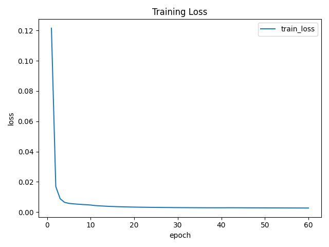
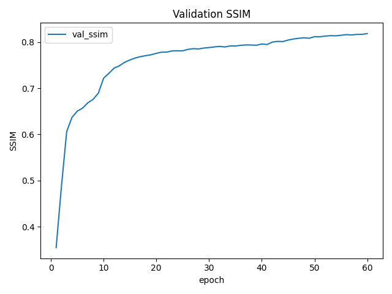
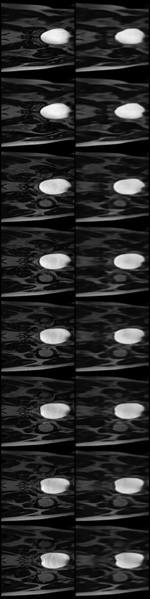

# VQVAE Generative Model of the HipMRI Study on Prostate Cancer

## Project Description

In this project, a **Vector Quantised Variational Autoencoder (VQVAE)** is used to learn latent representations of prostate MRI scans from the HipMRI study dataset.

The goal is to **generate and reconstruct 2D prostate MRI slices** with high similarity to the original images to effectively capture key tissue patterns that are relevant to prostate cancer.

The model was trained on 2D MRI slices converted from 3D NIfTI volumes and achieved a SSIM INDEX of 0.6 above on the test set.

This project falls under the **"Hard Difficulty"** category of the COMP3710 assignment.

## How It Works

The **VQVAE** model compresses each 2D MRI images into a smaller latent representation using an encoder and then reconstructs it through a decoder. **VQVAE** uses a codebook of discrete embeddings to help the model learn clearer and more structured features. Which in return lowers the blur and preserves important anatomy details. The model is then trained by minimizing both reconstruction error and a vector quantization loss, ensuring that the reconstructed images maintain a high level of similarity when compared to the original images.

### Dataloader

The **data loader** prepares 2D prostate MRI slices for training, validation and testing. It automatically reads all the .png images from the dataset folders and converts them to grayscale tensors which resizes them to **128x128** pixels for consistent input to the model. The images are then normalized to the **[0,1]** range to ensure stable learning. Pytorch is then used to return the batches of preprocessed images to enable efficiency in training in small batches.

### Encoder

The Encoder task is to transform each input of 2D prostate MRI slice into a lower-dimensional latent representation that captures essential structural and textural details while getting rid of unnecessary details. It takes the grayscale images with one input channel and progressively downsamples them to a smaller size while increasing the number of feature channels to capture complex patterns.

The encoder consists of several **convolutional layers** followed by **ReLU activations**, with kernel size 4, stride 2, and padding 1 and it effectively halve the image dimensions at each step. The number of feature channels increases from 64 up to 128, allowing the network to extract a deeper set of features from each MRI slice.

After that, the residual layers are added and it allows gradient flow directly across layers to help with the encoder. The residual structure prevents loss of small textural details that are critical in medical imaging. For example, variations in intensity between prostate regions.

The encoder outputs a compressed latent feature map (z_e) and is then passed to the Codebook for quantisation.

### Vector Quantiser

The codebook module converts continuous latent representations into descrete embeddings. Its basically a dictionary of all the **learned** visual tokens that represent common patterns across all MRI slices.

In this project, **512 embedding vectors** each consisting of **64 dimensions** are in the codebook. When the encoder produces its output, every vector in the map is compared with all 512 embeddings. Then the embedding with the smallest Euclidean distance is selected and is used to replace the original vector.

This is called vector quantisation and it ensures that the model repesents images using a set of learned features. It improves the sharpness and reduces the blur in the reconstructed images.

Two loss componenets are used during training:
1. **Codebook Loss**: Ensures the selected embedding vectors adapt toward the encoder's latent output.
2. **Commitment Loss**: Prevent the collapse of the codebook by ensuring the encoder outputs are close to the selected embeddings.

These are combined as the **vector quantisation loss** and is added to the **reconstruction loss** during training. 

Overall, this module helps the model to learn repeatable structural features such as texture variations and etc.

### Decoder

The Decoder reconstructs the MRI slice from the quantised latent representation produced by the codebook. It is used for upsampling the feature maps back to original size.

The decoder will use a 1x1 convolutional layer that prepares the quantised embeddings and it passes the features through multiple transposed convolutional layers(ConvTranspose2d) with kernel size 4, stride 2, and padding 1 which doubles the spatial resolution at each step. In between these layers, Residual block are then used to refine and stabilise the feature maps. Finally, a 3x3 convutional layer maps the feature maps back to a single grayscale output channel with pixel values betweeen 0 and 1.

This produces a reconstructed MRI slice that is similar to the original image to an extent.

### VQVAE

The VQVAE class integrates encoder, codebook and decoder(previously described class) into a single end-to-end model. It defines the forward pass and computes the total loss during training. 

The flow of the process in this project is as follows:
1. The encoder compresses the MRI slice into a latent feature map.
2. The codebook quantises the alten vectors into descirete embeddings and produces a quantised latent map.
3. The Decoder reconstructs the original MRI slice from the quantised map and generates the reconstructed output.

This design makes the system both interpretable and effective  for capturing high-level prostate MRI structures.

### Training

In training,
- Adam optimiser was implemented with a learning rate of **1e-4 over 60 epochs**. 
- Structural Similarity Index(SSIM) was used as an evaluation metric.
- Dataset is split into 3 different sets; train, val and test.
- Each image was normaised to [0,1] range
- Then resized to 128x128 pixels
- Then loaded by the DataLoader.
  
During each epoch:
1. The model processes MRI slices in batch.
2. The total loss is computed and backpropagated.
3. Validation SSIM is measured at the end of each epoch to monitor generalisation performance.
4. The model checkpoint with the highest SSIM is saved as best.pt

After all epochs are completed, the function plots the training loss and validation ssim scores over the epochs and then saves the plot as an image. This visualises changes in the model's performance throughout training.

### Prediction

Firstly, the prediction begins by initializing the VQVAE and then loads the best checkpoint(best.pt). This means that the model starts in a trained state. The script then selects GPU and moves the data into that device. It then calls model.eval() to turn off training-only behaviours and runs inference inside torch.no_grad(). Which avoids gradient tracking and reduces memory usage.

The HipMRISliceSet is then used to load 2D PNG prostate MRI slices from the test set and converted into a grayscale 128x128 pixel image and then normalized to [0,1] to match the training conditions. DataLoader then forms small batches without shuffling so results are reproducible.

The vector quantizer replaces each latent dictionary of 512 vectors and then turns the continuous encoder output into a descrete latent representation. Next, the decoder upsamples back to the original resolution using transposed convolutions and residual blocks.

Further more, skimage.metrics.structural_similarity and data_range=1.0 is used to compute Structural Similarity Index(SSIM) by getting the average across the batch. After the final score has been output, it is then automatically saved into the final_ssim.txt file. The script also saves a png in readme_images/ that shows and compares both original and reconstructed images.

## Dependencies

- python 3.10.11
- torch 2.2.1
- torchvision 0.17.1
- numpy 1.26.4
- opencv-python 4.10.0
- nibabel 5.2.0
- matplotlib 3.9.0
- scikit-image 0.23.2
- tqdm 4.66.4
- Pillow 10.2.0

## Results

The final SSIM score for the model was **0.8356** as per recorded in the final_ssim.txt

## Reproducibility

This project was designed to ensure that all results can be reproduced.
1. All random seeds were fixed to ensure consistent results across runs
2. Same preprocessing, hyperparameters and model settings were used for training, validation and testing.
   
To reproduce the result:
1. Install the dependencies
2. Have the proper dataset
3. Run train.py
4. Then run predict.py
5. Finally, the script will save the new image into readme_images/ and then print the Test SSIM as well as save it into final_ssim.txt
